# DIAGRAMMES DE CAS D'UTILISATION - EasyEcole

> **Version :** 1.0
> **Date :** 01/09/2026
> **Scope :** Tous les processus métier de la plateforme EasyEcole
> **Format :** Mermaid (compatible GitHub, GitLab, VSCode, etc.)

---

## Table des matières

1. [Acteurs du système](#1-acteurs-du-système)
2. [P1 - Processus Pédagogique](#2---p1---processus-pédagogique)
3. [P2 - Processus Financier & Comptable SYSCOHADA](#3---p2---processus-financier--comptable-syscohada)
4. [P3 - Processus RH, Paie & HAO](#4---p3---processus-rh-paie--hao)
5. [P4 - Processus E-Learning](#5---p4---processus-e-learning)
6. [P5 - Processus Communication & Collaboration](#6---p5---processus-communication--collaboration)
7. [P6 - Processus GED & Archivage](#7---p6---processus-ged--archivage)
8. [P7 - Processus Achats & Marchés](#8---p7---processus-achats--marchés)
9. [P8 - Processus Stocks](#9---p8---processus-stocks)
10. [P9 - Processus Immobilisations](#10---p9---processus-immobilisations)
11. [P10 - Processus Administration & Système](#11---p10---processus-administration--système)
12. [P11 - Processus Gestion Documentaire (DocGen)](#12---p11---processus-gestion-documentaire-docgen)
13. [P12 - Processus Espace Parents](#13---p12---processus-espace-parents)
14. [P14 - Processus Qualité](#14---p13---processus-qualité)
15. [P14 - Processus Stages & Insertion](#15---p14---processus-stages--insertion)
16. [P15 - Processus Reporting Global](#16---p15---processus-reporting-global)

---

## 1. Acteurs du système

### Acteurs principaux (humains)

| Acteur | Code | Description |
|--------|------|-------------|
| **Administrateur** | `ADMIN` | Super-utilisateur, gestion complète du système, rôles, permissions, paramétrage global |
| **Institution** | `INSTITUTION` | Direction de l'établissement, décisions stratégiques, validation finale |
| **Étudiant (Apprenant)** | `APPRENANT` | Élève/étudiant inscrit, consulte notes, paie frais, suit sa progression |
| **Enseignant** | `ENSEIGNANT` | Enseignant titularisé ou vacataire, saisi notes/présences, gère ses cours |
| **Parent** | `PARENT` | Parent/tuteur d'un étudiant, consulte les informations scolaires |
| **Secrétaire** | `SECRETAIRE` | Secrétariat, traitement des demandes administratives des étudiants |
| **Caissier/Banquier** | `CAISSIER_BANQUE` | Enregistre les paiements, gère les bordereaux, validation financière |
| **Cabinet Comptable** | `CABINET_COMPTABLE` | Cabinet externe, authentifie les bordereaux, vérifie les paiements |
| **ESA Compta** | `ESA_COMPTA` | Comptable interne, saisit les écritures comptables, imputation FIFO |
| **Comité d'Orientation** | `COMITE_ORIENTATION` | Comité de validation des inscriptions, valide/rejette les dossiers |
| **RH (Ressources Humaines)** | `RESSOURCES_HUMAINES` | Gestion du personnel, paie, congés, contrats |
| **Personnel Administratif** | `PERSONNEL_ADMINISTRATIF` | Personnel de soutien administratif |
| **Surveillant** | `SURVEILLANT` | Surveillant général, suivi des présences/discipline |

### Acteurs secondaires (systèmes)

| Acteur | Description |
|--------|-------------|
| **Système de messagerie (Email)** | Envoi automatique de notifications email (matricule, décisions, quittances) |
| **Cron Scheduler** | Planificateur de tâches automatiques (alertes échéances, relances) |
| **Système de stockage fichiers** | Stockage GED des documents uploadés |
| **Base de données MySQL** | Persistance des données |
| **SYSCOHADA/OHADA** | Norme comptable (référence externe pour les états financiers) |

---

## 2. - P1 - Processus Pédagogique

> Lots 0 à 7 : Admission, Inscription, Cours, Notes, Bulletins, Délibérations, Rattrapages, Clôture semestre

```mermaid
graph TB
    subgraph "ACTEURS"
        ETD[("Étudiant<br/>APPRENANT")]
        ENS[("Enseignant<br/>ENSEIGNANT")]
        ADM[("Admin<br/>ADMIN")]
        INS[("Institution<br/>INSTITUTION")]
        SEC[("Secrétaire<br/>SECRETAIRE")]
        COM[("Comité<br/>COMITE_ORIENTATION")]
        CAI[("Caissier<br/>CAISSIER_BANQUE")]
        CAB[("Cabinet<br/>CABINET_COMPTABLE")]
        ESA[("ESA Compta<br/>ESA_COMPTA")]
        PAR[("Parent<br/>PARENT")]
    end

    subgraph "ADMISSION & INSCRIPTION"
        UC1[UC01: Soumettre demande<br/>d'inscription]
        UC2[UC02: Choisir une session<br/>d'inscription]
        UC3[UC03: Choisir un parcours<br/>/ filière / niveau]
        UC4[UC04: Déposer les pièces<br/>justificatives]
        UC5[UC05: Consulter l'état<br/>de sa demande]
        UC6[UC06: Consulter les<br/>effectifs inscrits]
    end

    subgraph "PIPELINE INSCRIPTION (4 acteurs)"
        UC7[UC07: Authentifier le<br/>bordereau de paiement]
        UC8[UC08: Saisir le bordereau<br/>comptablement]
        UC9[UC09: Valider le dossier<br/>au comité]
        UC10[UC10: Finaliser l'affectation<br/>pédagogique]
    end

    subgraph "RÉINSCRIPTION"
        UC11[UC11: Planifier sa<br/>réinscription]
        UC12[UC12: Confirmer la<br/>planification réinscription]
    end

    subgraph "COURS & ENSEIGNEMENT"
        UC13[UC13: Gérer les emplois<br/>du temps]
        UC14[UC14: Gérer les Unités<br/>d'Enseignement (UE)]
        UC15[UC15: Consulter le cahier<br/>de texte]
        UC16[UC16: Saisir les présences]
        UC17[UC17: Saisir les notes]
        UC18[UC18: Consulter mes notes]
    end

    subgraph "ÉVALUATIONS & DÉLIBÉRATIONS"
        UC19[UC19: Gérer les sessions<br/>d'examen]
        UC20[UC20: Gérer les<br/>équivalences/dispenses]
        UC21[UC21: Calculer les<br/>moyennes]
        UC22[UC22: Générer les bulletins]
        UC23[UC23: Tenir le conseil<br/>de classe]
        UC24[UC24: Valider les<br/>décisions de passage]
    end

    subgraph "RATTRAPAGES"
        UC25[UC25: Créer une session<br/>de rattrapage]
        UC26[UC26: S'inscrire à un<br/>rattrapage]
        UC27[UC27: Traiter les demandes<br/>de rattrapage]
    end

    subgraph "CLÔTURE DE SEMESTRE"
        UC28[UC28: Clôturer le semestre]
        UC29[UC29: Geler la saisie<br/>des notes]
        UC30[UC30: Générer les dettes<br/>académiques]
        UC31[UC31: Lancer le semestre<br/>suivant]
    end

    %% Admission & Inscription
    ETD --> UC1
    ETD --> UC2
    ETD --> UC3
    ETD --> UC4
    ETD --> UC5
    INS --> UC6

    %% Pipeline inscription
    UC1 --> UC7
    CAI --> UC7
    CAB --> UC7
    UC7 --> UC8
    ESA --> UC8
    UC8 --> UC9
    COM --> UC9
    UC9 --> UC10

    %% Réinscription
    ETD --> UC11
    ADM --> UC12
    INS --> UC12
    UC11 -.-> UC12

    %% Cours
    ENS --> UC13
    ENS --> UC14
    ENS --> UC15
    ENS --> UC16
    ENS --> UC17
    ETD --> UC18
    ADM --> UC14

    %% Évaluations
    ADM --> UC19
    SEC --> UC19
    ENS --> UC20
    ADM --> UC20
    ENS --> UC21
    ADM --> UC22
    SEC --> UC22
    ADM --> UC23
    INS --> UC23
    ADM --> UC24

    %% Rattrapages
    ADM --> UC25
    INS --> UC25
    ETD --> UC26
    SEC --> UC27
    ADM --> UC27

    %% Clôture
    ADM --> UC28
    ADM --> UC29
    UC29 --> UC30
    ADM --> UC31
```

### Détail des cas d'utilisation - Pédagogique

| UC | Cas d'utilisation | Acteur(s) | Description |
|----|-------------------|-----------|-------------|
| UC01 | Soumettre demande d'inscription | APPRENANT | Remplit le formulaire d'inscription, choisit parcours/session |
| UC02 | Choisir session d'inscription | APPRENANT | Sélectionne la session académique ouverte |
| UC03 | Choisir parcours/filière/niveau | APPRENANT | Définit son parcours de formation souhaité |
| UC04 | Déposer pièces justificatives | APPRENANT | Upload des documents (acte naissance, diplômes, photo...) |
| UC05 | Consulter état demande | APPRENANT | Suit l'avancement de son dossier (timeline 13 étapes) |
| UC06 | Consulter effectifs | INSTITUTION | Vue des effectifs par session/filière/classe |
| UC07 | Authentifier bordereau | CAISSIER_BANQUE, CABINET_COMPTABLE | Vérifie la preuve de paiement, authentifie le bordereau |
| UC08 | Saisir bordereau comptable | ESA_COMPTA | Enregistre les montants, calcule l'imputation FIFO, écriture auto |
| UC09 | Valider dossier au comité | COMITE_ORIENTATION | Examine le dossier complet (4 volets), valide/corrige/rejette |
| UC10 | Finaliser affectation pédagogique | SYSTÈME (déclenché par UC09) | Matricule, cursus, cours, carte, GED, email officiel |
| UC11 | Planifier réinscription | APPRENANT | Étudiant admissible planifie son passage en année supérieure |
| UC12 | Confirmer planification réinscription | ADMIN, INSTITUTION | Valide ou rejette la planification de réinscription |
| UC13 | Gérer emplois du temps | ENSEIGNANT, ADMIN | CRUD des plannings de cours |
| UC14 | Gérer UE/cours | ENSEIGNANT, ADMIN | Création/modification des unités d'enseignement |
| UC15 | Consulter cahier de texte | ENSEIGNANT | Saisie/consultation des séances et contenus |
| UC16 | Saisir présences | ENSEIGNANT | Pointage des présences étudiants par séance |
| UC17 | Saisir notes | ENSEIGNANT | Saisie des notes par cours/UE |
| UC18 | Consulter mes notes | APPRENANT | Consultation des notes, moyennes, validation UE (vert/rouge) |
| UC19 | Gérer sessions d'examen | ADMIN, SECRETAIRE | Configuration des sessions d'examens |
| UC20 | Gérer équivalences/dispenses | ENSEIGNANT, ADMIN | Validation des équivalences de notes entre UV |
| UC21 | Calculer moyennes | ENSEIGNANT, SYSTÈME | Calcul automatique des moyennes par UE/semestre |
| UC22 | Générer bulletins | ADMIN, SECRETAIRE | Génération automatique des bulletins de notes |
| UC23 | Conseil de classe | ADMIN, INSTITUTION | Tenue du conseil de classe et délibérations |
| UC24 | Valider décisions de passage | ADMIN, INSTITUTION | Admission, rattrapage, redoublement, exclusion |
| UC25 | Créer session rattrapage | ADMIN, INSTITUTION | Configuration d'une session de rattrapage |
| UC26 | S'inscrire rattrapage | APPRENANT | Inscription à un rattrapage + dépôt documents |
| UC27 | Traiter demandes rattrapage | SECRETAIRE, ADMIN | Validation/rejet des demandes de rattrapage |
| UC28 | Clôturer semestre | ADMIN | Déclenchement du workflow de clôture |
| UC29 | Geler notes | ADMIN, SYSTÈME | Gel de la saisie des notes (irréversible) |
| UC30 | Générer dettes académiques | SYSTÈME | Identification des UE non validées → dettes |
| UC31 | Lancer semestre suivant | ADMIN | Activation du nouveau semestre, affichage cours |

---

## 3. - P2 - Processus Financier & Comptable SYSCOHADA

> Lots S0-S4 (états financiers) + F1-F3 (compta complémentaire) + paiements étudiants

```mermaid
graph TB
    subgraph "ACTEURS"
        ETD[("Étudiant<br/>APPRENANT")]
        CAI[("Caissier<br/>CAISSIER_BANQUE")]
        CAB[("Cabinet<br/>CABINET_COMPTABLE")]
        ESA[("ESA Compta<br/>ESA_COMPTA")]
        ADM[("Admin<br/>ADMIN")]
        INS[("Institution<br/>INSTITUTION")]
        PAR[("Parent<br/>PARENT")]
    end

    subgraph "PAIEMENTS FRAIS SCOLAIRES"
        UC1[UC32: Effectuer un<br/>paiement]
        UC2[UC33: Consulter l'échéancier<br/>des frais]
        UC3[UC34: Consulter historique<br/>de mes paiements]
        UC4[UC35: Générer un quitus<br/>de paiement]
        UC5[UC36: Relancer les<br/>impayés]
    end

    subgraph "BORDEREAUX & TRAITEMENT"
        UC6[UC37: Créer un bordereau<br/>de paiement]
        UC7[UC38: Valider/Authentifier<br/>bordereau]
        UC8[UC39: Saisir bordereau<br/>comptablement]
        UC9[UC40: Imputer par<br/>méthode FIFO]
        UC10[UC41: Générer écriture<br/>comptable automatique]
    end

    subgraph "PLAN COMPTABLE & ÉCRITURES"
        UC11[UC42: Gérer le plan<br/>comptable]
        UC12[UC43: Saisir des écritures<br/>comptables]
        UC13[UC44: Consulter la balance]
        UC14[UC45: Consulter le<br/>grand livre]
        UC15[UC46: Consulter les<br/>écritures du journal]
    end

    subgraph "ÉTATS FINANCIERS SYSCOHADA"
        UC16[UC47: Générer le Bilan<br/>format OHADA]
        UC17[UC48: Générer le Compte<br/>de Résultat]
        UC18[UC49: Générer le TAFIRE]
        UC19[UC50: Générer les notes<br/>annexes ETATC]
        UC20[UC51: Assemblage dossier<br/>complet PDF]
        UC21[UC52: Exporter états<br/>PDF/Excel]
    end

    subgraph "TRÉSORERIE & BANQUE"
        UC22[UC53: Gérer les comptes<br/>bancaires]
        UC23[UC54: Importer relevés<br/>bancaires]
        UC24[UC55: Rapprochement<br/>bancaire]
    end

    subgraph "CLÔTURE D'EXERCICE"
        UC25[UC56: Clôturer l'exercice<br/>comptable]
        UC26[UC57: Calculer le résultat<br/>+ écritures détermination]
        UC27[UC58: Effectuer le report<br/>à nouveau]
    end

    subgraph "ACHATS & FACTURES"
        UC28[UC59: Saisir facture<br/>fournisseur]
        UC29[UC60: Enregistrer paiement<br/>fournisseur]
        UC30[UC61: Effectuer rapprochement<br/>fournisseur]
    end

    %% Paiements
    ETD --> UC1
    ETD --> UC2
    ETD --> UC3
    CAI --> UC6
    PAR --> UC3
    CAI --> UC5
    CAI --> UC4

    %% Bordereaux
    UC6 --> UC7
    CAB --> UC7
    UC7 --> UC8
    ESA --> UC8
    UC8 --> UC9
    UC9 --> UC10

    %% Plan comptable
    ADM --> UC11
    ESA --> UC12
    ESA --> UC13
    ESA --> UC14
    ESA --> UC15

    %% États financiers
    ESA --> UC16
    ADM --> UC16
    INS --> UC16
    ESA --> UC17
    ESA --> UC18
    ESA --> UC19
    UC16 --> UC20
    UC17 --> UC20
    UC18 --> UC20
    UC19 --> UC20
    UC20 --> UC21
    ADM --> UC21
    INS --> UC21

    %% Trésorerie
    ESA --> UC22
    ADM --> UC22
    ESA --> UC23
    ESA --> UC24

    %% Clôture
    ESA --> UC25
    ADM --> UC25
    UC25 --> UC26
    UC26 --> UC27

    %% Achats
    ESA --> UC28
    ESA --> UC29
    ESA --> UC30
```

### Détail des cas d'utilisation - Financier & Comptable

| UC | Cas d'utilisation | Acteur(s) | Description |
|----|-------------------|-----------|-------------|
| UC32 | Effectuer un paiement | APPRENANT | Paiement de frais via bordereau (virement/espèces/mobile/chèque) |
| UC33 | Consulter échéancier frais | APPRENANT, PARENT | Liste des échéances avec montants, dates, statuts |
| UC34 | Consulter historique paiements | APPRENANT, PARENT | Historique des paiements effectués avec quittances |
| UC35 | Générer quitus | CAISSIER, SYSTÈME | Quitus PDF automatique après validation du paiement |
| UC36 | Relancer impayés | CAISSIER, SYSTÈME (cron) | Envoi de relances pour échéances en retard |
| UC37 | Créer bordereau paiement | CAISSIER_BANQUE | Saisie du bordereau avec preuve de paiement |
| UC38 | Valider/Authentifier bordereau | CABINET_COMPTABLE | Vérification de la conformité du paiement |
| UC39 | Saisir bordereau comptable | ESA_COMPTA | Enregistrement comptable avec montants et répartition |
| UC40 | Imputer FIFO | SYSTÈME | Imputation automatique First-In-First-Out sur échéances |
| UC41 | Générer écriture comptable auto | SYSTÈME | Écriture de crédit (701/702/706) automatique |
| UC42 | Gérer plan comptable | ADMIN | CRUD des comptes OHADA (classes 1-9) |
| UC43 | Saisir écritures comptables | ESA_COMPTA | Écritures manuelles au journal général |
| UC44 | Consulter balance | ESA_COMPTA, ADMIN | Balance comptable par période et compte |
| UC45 | Consulter grand livre | ESA_COMPTA | Détail des mouvements par compte |
| UC46 | Consulter journal écritures | ESA_COMPTA | Liste chronologique des écritures |
| UC47 | Générer Bilan OHADA | ESA_COMPTA, INSTITUTION | Bilan au format officiel SYSCOHADA révisé 2017 |
| UC48 | Générer Compte de Résultat | ESA_COMPTA, INSTITUTION | Produits et charges par nature, résultat |
| UC49 | Générer TAFIRE | ESA_COMPTA, INSTITUTION | Tableau des emplois et ressources |
| UC50 | Générer notes annexes ETATC | ESA_COMPTA | ~25-30 notes annexes (immobilisations, stocks, dettes...) |
| UC51 | Assemblage dossier complet PDF | ESA_COMPTA, INSTITUTION | Dossier complet 60+ pages, sommaire, pagination |
| UC52 | Exporter états PDF/Excel | ESA_COMPTA, INSTITUTION, ADMIN | Export multi-format des états financiers |
| UC53 | Gérer comptes bancaires | ESA_COMPTA, ADMIN | CRUD des comptes bancaires de l'établissement |
| UC54 | Importer relevés bancaires | ESA_COMPTA | Import des mouvements bancaires |
| UC55 | Rapprochement bancaire | ESA_COMPTA | Lettrage/délettrage entre écritures et mouvements bancaires |
| UC56 | Clôturer exercice comptable | ESA_COMPTA, INSTITUTION | Workflow : contrôles → calcul résultat → clôture → report à nouveau |
| UC57 | Calculer résultat + écritures détermination | SYSTÈME | Écritures de détermination classe 12 automatiques |
| UC58 | Report à nouveau | SYSTÈME | Transfert des soldes classe 6/7 → classe 11/12 |
| UC59 | Saisir facture fournisseur | ESA_COMPTA | Enregistrement des factures fournisseurs |
| UC60 | Enregistrer paiement fournisseur | ESA_COMPTA | Paiement et comptabilisation fournisseurs |
| UC61 | Rapprochement fournisseur | ESA_COMPTA | Lettrage factures/factures fournisseurs |

---

## 4. - P3 - Processus RH, Paie & HAO

> Lots R1-R5 : Référentiel RH, Pointage, Calcul HAO, Paie prestataires, Charges sociales Togo

```mermaid
graph TB
    subgraph "ACTEURS"
        ENS[("Enseignant<br/>ENSEIGNANT")]
        RH[("RH<br/>RESSOURCES_HUMAINES")]
        ADM[("Admin<br/>ADMIN")]
        INS[("Institution<br/>INSTITUTION")]
        ESA[("ESA Compta<br/>ESA_COMPTA")]
    end

    subgraph "RÉFÉRENTIEL RH"
        UC1[UC62: Gérer les employés<br/>et enseignants]
        UC2[UC63: Gérer les statuts<br/>enseignants]
        UC3[UC64: Gérer les catégories<br/>professionnelles]
        UC4[UC65: Gérer les grilles<br/>salariales]
        UC5[UC66: Gérer les contrats<br/>enseignants]
        UC6[UC67: Paramétrer les charges<br/>sociales Togo]
    end

    subgraph "POINTAGE & PRÉSENCE"
        UC7[UC68: Pointer son<br/>arrivée/départ]
        UC8[UC69: Consulter l'historique<br/>de pointages]
        UC9[UC70: Consulter les rapports<br/>de pointage]
        UC10[UC71: Gérer les shifts<br/>et plannings]
        UC11[UC72: Consulter les absences]
    end

    subgraph "HEURES HAO"
        UC12[UC73: Agréger les heures<br/>depuis les pointages]
        UC13[UC74: Calculer les heures<br/>HAO vs activité ordinaire]
        UC14[UC75: Consulter le compteur<br/>quota HAO annuel]
        UC15[UC76: Alerter dépassement<br/>quota HAO]
    end

    subgraph "PAIE & BULLETINS"
        UC16[UC77: Générer le bulletin<br/>de paie]
        UC17[UC78: Calculer les primes,<br/>heures sup., retenues]
        UC18[UC79: Consulter les bulletins<br/>de paie]
        UC19[UC80: Gérer prêts et<br/>avances]
    end

    subgraph "ÉCRITURES COMPTABLES RH"
        UC20[UC81: Générer écritures<br/>de charge de personnel]
        UC21[UC82: Générer dette<br/>vers enseignant]
        UC22[UC83: Lettrer au paiement<br/>de la HAO]
    end

    subgraph "CONGÉS & ABSENCES"
        UC23[UC84: Demander un congé]
        UC24[UC85: Valider/Rejeter<br/>demande de congé]
        UC25[UC86: Suivre les soldes<br/>de congé]
    end

    subgraph "RECRUTEMENT & FORMATION"
        UC26[UC87: Publier offres<br/>d'emploi]
        UC27[UC88: Gérer candidatures]
        UC28[UC89: Planifier formations]
    end

    %% Référentiel
    RH --> UC1
    ADM --> UC1
    RH --> UC2
    RH --> UC3
    RH --> UC4
    RH --> UC5
    ADM --> UC6
    RH --> UC6

    %% Pointage
    ENS --> UC7
    ENS --> UC8
    RH --> UC9
    ADM --> UC10
    RH --> UC10
    ENS --> UC11
    RH --> UC12

    %% HAO
    UC7 --> UC12
    UC12 --> UC13
    UC13 --> UC14
    UC14 --> UC15
    RH --> UC15
    ADM --> UC15

    %% Paie
    UC13 --> UC16
    RH --> UC16
    UC16 --> UC17
    RH --> UC18
    ENS --> UC19
    RH --> UC19

    %% Écritures RH
    UC16 --> UC20
    UC20 --> UC21
    UC21 --> UC22
    ESA --> UC22

    %% Congés
    ENS --> UC23
    RH --> UC24
    ADM --> UC24
    ENS --> UC25
    RH --> UC25

    %% Recrutement
    RH --> UC26
    ADM --> UC26
    RH --> UC27
    RH --> UC28
```

### Détail des cas d'utilisation - RH & Paie

| UC | Cas d'utilisation | Acteur(s) | Description |
|----|-------------------|-----------|-------------|
| UC62 | Gérer employés/enseignants | RH, ADMIN | CRUD du personnel (fiche, contrat, postes) |
| UC63 | Gérer statuts enseignants | RH, ADMIN | Paramétrage : vacataire/permanent/assistant + quota + taux HAO |
| UC64 | Gérer catégories professionnelles | RH | CRUD des catégories et échelons |
| UC65 | Gérer grilles salariales | RH, ADMIN | Grilles de rémunération par catégorie |
| UC66 | Gérer contrats enseignants | RH | CRUD des contrats d'enseignement |
| UC67 | Paramétrer charges sociales Togo | RH, ADMIN | CNSS salariale/patronale, IR, autres prélèvements |
| UC68 | Pointer arrivée/départ | ENSEIGNANT | Pointage via terminal QR ou interface |
| UC69 | Consulter historique pointages | ENSEIGNANT | Historique personnel des pointages |
| UC70 | Rapports de pointage | RH, ADMIN | Statistiques de présence par période |
| UC71 | Gérer shifts/plannings | RH, ADMIN | Configuration des plannings de travail |
| UC72 | Consulter absences | ENSEIGNANT, RH | Liste des absences enregistrées |
| UC73 | Agréger heures depuis pointages | SYSTÈME | Calcul automatique des heures effectives |
| UC74 | Calculer HAO vs activité ordinaire | SYSTÈME | Comparaison emploi du temps vs pointages réels |
| UC75 | Consulter compteur quota HAO | ENSEIGNANT, RH | Heures effectuées vs quota annuel |
| UC76 | Alerter dépassement quota HAO | SYSTÈME, RH | Notification si quota dépassé |
| UC77 | Générer bulletin de paie | RH, SYSTÈME | Bulletin automatique (volume × taux horaire) |
| UC78 | Calculer primes/retenues | SYSTÈME | Calcul paramétrable : primes, HS, avances, prêts |
| UC79 | Consulter bulletins paie | ENSEIGNANT, RH | Consultation des bulletins générés |
| UC80 | Gérer prêts/avances | RH | CRUD des avances et prêts au personnel |
| UC81 | Générer écritures charge personnel | SYSTÈME | Écritures comptables auto (comptes 64/65) |
| UC82 | Générer dette enseignant | SYSTÈME | Provisions HAO non payées (comptes 42/47) |
| UC83 | Lettrer paiement HAO | ESA_COMPTA, SYSTÈME | Lettrage automatique au paiement effectif |
| UC84 | Demander congé | ENSEIGNANT | Soumission de demande de congé en ligne |
| UC85 | Valider/Rejeter congé | RH, ADMIN | Workflow de validation des congés |
| UC86 | Suivre soldes congé | ENSEIGNANT, RH | Consultation des soldes restants |
| UC87 | Publier offres emploi | RH, ADMIN | CRUD des offres d'emploi |
| UC88 | Gérer candidatures | RH | Suivi des candidatures recues |
| UC89 | Planifier formations | RH | Organisation des formations du personnel |

---

## 5. - P4 - Processus E-Learning

> Lots EL1-EL3 : Rattachement hiérarchique, catalogue arborescent, entités e-learning

```mermaid
graph TB
    subgraph "ACTEURS"
        ETD[("Étudiant<br/>APPRENANT")]
        ENS[("Enseignant<br/>ENSEIGNANT")]
        ADM[("Admin<br/>ADMIN")]
    end

    subgraph "CATALOGUE & NAVIGATION"
        UC1[UC90: Naviguer dans<br/>le catalogue arborescent]
        UC2[UC91: Consulter les cours<br/>en ligne]
        UC3[UC92: Filtrer par Année/<br/>Parcours/Filière/Niveau]
    end

    subgraph "COURS EN LIGNE"
        UC4[UC93: Consulter vidéos<br/>de cours]
        UC5[UC94: Consulter supports<br/>PDF]
        UC6[UC95: Télécharger supports]
    end

    subgraph "ÉVALUATIONS EN LIGNE"
        UC7[UC96: Passer un quiz]
        UC8[UC97: Consulter résultat<br/>quiz]
        UC9[UC98: Soumettre un devoir]
        UC10[UC99: Noter/commenter<br/>un devoir]
    end

    subgraph "PROGRESSION & CERTIFICATS"
        UC11[UC100: Suivre sa progression]
        UC12[UC101: Obtenir certificat<br/>de complétion]
    end

    subgraph "ADMINISTRATION E-LEARNING"
        UC13[UC102: Créer/Modifier cours<br/>en ligne]
        UC14[UC103: Attacher cours au<br/>Cours pédagogique]
        UC15[UC104: Gérer devoirs,<br/>quiz, supports]
        UC16[UC105: Consulter progression<br/>des apprenants]
    end

    subgraph "INTERACTION"
        UC17[UC106: Participer au chat<br/>/ salon en ligne]
        UC18[UC107: Consulter notifications<br/>e-learning]
    end

    %% Navigation
    ETD --> UC1
    ETD --> UC2
    ETD --> UC3

    %% Cours
    ETD --> UC4
    ETD --> UC5
    ETD --> UC6

    %% Évaluations
    ETD --> UC7
    ETD --> UC8
    ETD --> UC9
    ENS --> UC10

    %% Progression
    ETD --> UC11
    ETD --> UC12

    %% Admin
    ENS --> UC13
    ENS --> UC14
    ADM --> UC13
    ENS --> UC15
    ENS --> UC16
    ADM --> UC16

    %% Interaction
    ETD --> UC17
    ENS --> UC17
    ETD --> UC18
    ENS --> UC18
```

### Détail des cas d'utilisation - E-Learning

| UC | Cas d'utilisation | Acteur(s) | Description |
|----|-------------------|-----------|-------------|
| UC90 | Naviguer catalogue arborescent | APPRENANT | Navigation Année → Parcours → Filière → Niveau → Cours |
| UC91 | Consulter cours en ligne | APPRENANT | Liste des cours auxquels l'étudiant est inscrit |
| UC92 | Filtrer par hiérarchie académique | APPRENANT | Filtres combinés sur la structure académique |
| UC93 | Consulter vidéos | APPRENANT | Lecture streaming des vidéos de cours |
| UC94 | Consulter supports PDF | APPRENANT | Consultation des supports de cours PDF |
| UC95 | Télécharger supports | APPRENANT | Téléchargement pour consultation hors ligne |
| UC96 | Passer un quiz | APPRENANT | Passage de quiz avec soumission et correction |
| UC97 | Consulter résultat quiz | APPRENANT | Score détaillé après correction |
| UC98 | Soumettre un devoir | APPRENANT | Upload du fichier de devoir |
| UC99 | Noter/commenter devoir | ENSEIGNANT | Notation et retour sur les devoirs soumis |
| UC100 | Suivre progression | APPRENANT | Statistiques de progression par cours |
| UC101 | Obtenir certificat | APPRENANT | Génération et téléchargement du certificat |
| UC102 | Créer/Modifier cours en ligne | ENSEIGNANT, ADMIN | CRUD du cours e-learning |
| UC104 | Attacher cours au Cours pédagogique | ENSEIGNANT, ADMIN | Rattachement hiérarchique (EL1) |
| UC105 | Gérer devoirs/quiz/supports | ENSEIGNANT | CRUD des contenus pédagogiques |
| UC106 | Consulter progression apprenants | ENSEIGNANT, ADMIN | Tableau de bord de suivi |
| UC107 | Chat salon en ligne | APPRENANT, ENSEIGNANT | Communication temps réel (Socket + SSE) |
| UC108 | Notifications e-learning | APPRENANT, ENSEIGNANT | Alertes de nouveaux cours, devoirs, notes |

---

## 6. - P5 - Processus Communication & Collaboration

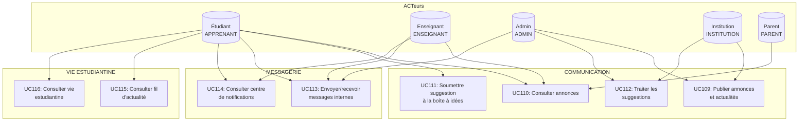

### Détail des cas d'utilisation - Communication

| UC | Cas d'utilisation | Acteur(s) | Description |
|----|-------------------|-----------|-------------|
| UC109 | Publier annonces | INSTITUTION, ADMIN | Création d'annonces et actualités |
| UC110 | Consulter annonces | APPRENANT, ENSEIGNANT, PARENT | Lecture des annonces publiées |
| UC111 | Soumettre suggestion | APPRENANT | Boîte à suggestions/ids de la communauté |
| UC112 | Traiter suggestions | ADMIN, INSTITUTION | Traitement et retour sur les suggestions |
| UC113 | Messages internes | APPRENANT, ENSEIGNANT, ADMIN | Messagerie interne de la plateforme |
| UC114 | Centre notifications | APPRENANT, ENSEIGNANT | Consultation des notifications personnalisées |
| UC115 | Consulter fil d'actualité | APPRENANT | Fil d'actualités de la vie scolaire |
| UC116 | Consulter vie estudiantine | APPRENANT | Contenus de la vie estudiantine |

---

## 7. - P6 - Processus GED & Archivage

```mermaid
graph TB
    subgraph "ACTEURS"
        ETD[("Étudiant<br/>APPRENANT")]
        ADM[("Admin<br/>ADMIN")]
        INS[("Institution<br/>INSTITUTION")]
        SEC[("Secrétaire<br/>SECRETAIRE")]
        ESA[("ESA Compta<br/>ESA_COMPTA")]
    end

    subgraph "CATALOGUE DOCUMENTAIRE"
        UC1[UC117: Rechercher<br/>un document]
        UC2[UC118: Naviguer le<br/>catalogue GED]
        UC3[UC119: Recherche avancée<br/>plein texte]
    end

    subgraph "GESTION DOCUMENTS"
        UC4[UC120: Téléverser un<br/>document]
        UC5[UC121: Téléverser par lot]
        UC6[UC122: Saisir un document]
        UC7[UC123: Créer des dossiers<br/>virtuels]
    end

    subgraph "ARCHIVAGE & CONSERVATION"
        UC8[UC124: Gérer les durées<br/>de conservation]
        UC9[UC125: Archiver documents]
        UC10[UC126: Créer bordereaux<br/>d'élimination]
        UC11[UC127: Fusionner documents<br/>PDF]
    end

    subgraph "GED INSCRIPTION"
        UC12[UC128: Stocker dossiers<br/>étudiants]
        UC13[UC129: Vérifier intégrité<br/>fichier ↔ BDD]
    end

    %% Catalogue
    ETD --> UC1
    ADM --> UC1
    SEC --> UC1
    ESA --> UC1
    ADM --> UC2
    INS --> UC2
    ADM --> UC3

    %% Gestion
    ETD --> UC4
    SEC --> UC4
    ADM --> UC5
    SEC --> UC5
    SEC --> UC6
    ADM --> UC7

    %% Archivage
    ADM --> UC8
    INS --> UC8
    ADM --> UC9
    ADM --> UC10
    ADM --> UC11

    %% GED Inscription
    SEC --> UC12
    ADM --> UC13
```

### Détail des cas d'utilisation - GED

| UC | Cas d'utilisation | Acteur(s) | Description |
|----|-------------------|-----------|-------------|
| UC117 | Rechercher document | TOUS (avec droits) | Recherche dans le catalogue documentaire |
| UC118 | Naviguer catalogue GED | ADMIN, INSTITUTION | Exploration de l'arborescence documentaire |
| UC119 | Recherche avancée plein texte | ADMIN | Recherche full-text avec facettes |
| UC120 | Téléverser document | APPRENANT, SECRETAIRE | Upload de documents individuels |
| UC121 | Téléverser par lot | ADMIN, SECRETAIRE | Upload multiple de documents |
| UC122 | Saisir document | SECRETAIRE | Enregistrement manuel de métadonnées |
| UC123 | Créer dossiers virtuels | ADMIN | Organisation en dossiers de la GED |
| UC124 | Gérer conservation | ADMIN, INSTITUTION | Paramétrage des durées de conservation |
| UC125 | Archiver documents | ADMIN | Déplacement vers les archives |
| UC126 | Bordereaux d'élimination | ADMIN | Gestion de la fin de cycle de vie des documents |
| UC127 | Fusionner PDF | ADMIN | Concaténation de documents en un seul PDF |
| UC128 | Stocker dossiers étudiants | SECRETAIRE | Stockage GED automatique lors de l'inscription |
| UC129 | Vérifier intégrité | ADMIN | Contrôle fichier ↔ base de données |

---

## 8. - P7 - Processus Achats & Marchés

```mermaid
graph TB
    subgraph "ACTEURS"
        ADM[("Admin<br/>ADMIN")]
        INS[("Institution<br/>INSTITUTION")]
        ESA[("ESA Compta<br/>ESA_COMPTA")]
    end

    subgraph "ACHATS"
        UC1[UC130: Créer demande<br/>d'achat]
        UC2[UC131: Valider demande<br/>d'achat]
        UC3[UC132: Créer bon<br/>de commande]
        UC4[UC133: Réceptionner<br/>commande]
        UC5[UC134: Saisir facture<br/>fournisseur]
        UC6[UC135: Gérer fournisseurs]
        UC7[UC136: Gérer budgets<br/>achats]
    end

    subgraph "MARCHÉS PUBLICS"
        UC8[UC137: Planifier<br/>un marché]
        UC9[UC138: Publier AMI]
        UC10[UC139: Lancer appel<br/>d'offres]
        UC11[UC140: Attribuer marché]
        UC12[UC141: Gérer contrats<br/>de marché]
        UC13[UC142: Gérer avenants]
    end

    %% Achats
    INS --> UC1
    ADM --> UC2
    INS --> UC2
    ADM --> UC3
    ADM --> UC4
    ESA --> UC5
    ADM --> UC6
    ADM --> UC7
    INS --> UC7

    %% Marchés
    ADM --> UC8
    INS --> UC8
    ADM --> UC9
    ADM --> UC10
    INS --> UC10
    INS --> UC11
    ADM --> UC12
    ADM --> UC13
```

### Détail des cas d'utilisation - Achats & Marchés

| UC | Cas d'utilisation | Acteur(s) | Description |
|----|-------------------|-----------|-------------|
| UC130 | Créer demande achat | INSTITUTION | Demande d'achat avec description et budget |
| UC131 | Valider demande achat | ADMIN, INSTITUTION | Workflow de validation (approbation/rejet) |
| UC132 | Créer bon de commande | ADMIN | Génération du bon de commande |
| UC133 | Réceptionner commande | ADMIN | Enregistrement de la réception des biens |
| UC134 | Saisir facture fournisseur | ESA_COMPTA | Enregistrement comptable de la facture |
| UC135 | Gérer fournisseurs | ADMIN | CRUD des fournisseurs partenaires |
| UC136 | Gérer budgets achats | ADMIN, INSTITUTION | Paramétrage et suivi des budgets |
| UC137 | Planifier marché | ADMIN, INSTITUTION | Planification annuelle des marchés |
| UC138 | Publier AMI | ADMIN | Appel à Manifestation d'Intérêt |
| UC139 | Lancer appel d'offres | ADMIN, INSTITUTION | Lancement et publication d'un AO |
| UC140 | Attribuer marché | INSTITUTION | Décision d'attribution du marché |
| UC141 | Gérer contrats marché | ADMIN | CRUD des contrats de marché |
| UC142 | Gérer avenants | ADMIN | Modifications des contrats de marché |

---

## 9. - P8 - Processus Stocks

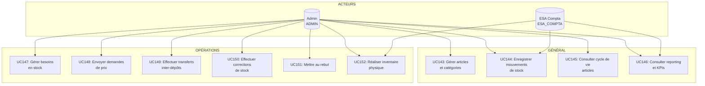

### Détail des cas d'utilisation - Stocks

| UC | Cas d'utilisation | Acteur(s) | Description |
|----|-------------------|-----------|-------------|
| UC143 | Gérer articles/catégories | ADMIN | CRUD des articles et catégories de stock |
| UC144 | Mouvements de stock | ADMIN, ESA_COMPTA | Entrées, sorties de stock |
| UC145 | Cycle de vie articles | ADMIN | Historique complet d'un article |
| UC146 | Reporting/KPIs | ADMIN, ESA_COMPTA | Tableaux de bord stocks, alertes |
| UC147 | Gérer besoins | ADMIN | Planification des besoins en stock |
| UC148 | Demandes de prix | ADMIN | Envoi de demandes de prix aux fournisseurs |
| UC149 | Transferts inter-dépôts | ADMIN | Mouvements entre dépôts |
| UC150 | Corrections de stock | ADMIN | Ajustements d'inventaire |
| UC151 | Mise au rebut | ADMIN | Sortie définitive d'articles |
| UC152 | Inventaire physique | ADMIN, ESA_COMPTA | Comptage physique et rapprochement |

---

## 10. - P9 - Processus Immobilisations

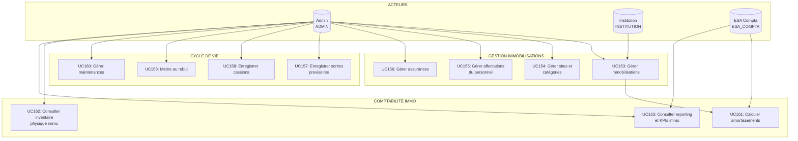

### Détail des cas d'utilisation - Immobilisations

| UC | Cas d'utilisation | Acteur(s) | Description |
|----|-------------------|-----------|-------------|
| UC153 | Gérer immobilisations | ADMIN, INSTITUTION | CRUD des biens immobilisés |
| UC154 | Gérer sites/catégories | ADMIN | Organisation par site et catégorie |
| UC155 | Affectations personnel | ADMIN | Suivi des biens affectés au personnel |
| UC156 | Gérer assurances | ADMIN | Suivi des polices d'assurance |
| UC157 | Sorties provisoires | ADMIN | Enregistrement des sorties temporaires |
| UC158 | Enregistrer cessions | ADMIN | Vente ou cession de biens |
| UC159 | Mettre au rebut | ADMIN | Sortie définitive d'immobilisations |
| UC160 | Gérer maintenances | ADMIN | Suivi des opérations de maintenance |
| UC161 | Calculer amortissements | SYSTÈME, ESA_COMPTA | Calcul automatique des amortissements |
| UC162 | Inventaire physique immo | ADMIN | Comptage et vérification des biens |
| UC163 | Reporting immo | ADMIN, ESA_COMPTA | Tableaux de bord et KPIs immobilisations |

---

## 11. - P10 - Processus Administration & Système

```mermaid
graph TB
    subgraph "ACTEURS"
        ADM[("Admin<br/>ADMIN")]
        INS[("Institution<br/>INSTITUTION")]
    end

    subgraph "GESTION UTILISATEURS"
        UC1[UC164: Gérer utilisateurs<br/>et comptes]
        UC2[UC165: Gérer rôles et<br/>permissions]
        UC3[UC166: Générer QR Codes]
        UC4[UC167: Gérer cartes<br/>étudiant/personnel]
    end

    subgraph "AUDIT & TRAÇABILITÉ"
        UC5[UC168: Consulter journal<br/>d'audit]
        UC6[UC169: Consulter logs<br/>de sécurité]
    end

    subgraph "PARAMÉTRAGE SYSTÈME"
        UC7[UC170: Configurer l'école<br/>/ établissement]
        UC8[UC171: Gérer années<br/>académiques]
        UC9[UC172: Gérer frais<br/>généraux]
        UC10[UC173: Configurer<br/>notifications]
        UC11[UC174: Sauvegarder/restaurer<br/>la base de données]
    end

    subgraph "AUTHENTIFICATION"
        UC12[UC175: S'authentifier<br/>(login)]
        UC13[UC176: Réinitialiser<br/>mot de passe]
        UC14[UC177: Vérifier OTP<br/>(2FA)]
    end

    subgraph "MON PROFIL"
        UC15[UC178: Consulter/Modifier<br/>mon profil]
        UC16[UC179: Modifier mon<br/>mot de passe]
    end

    %% Utilisateurs
    ADM --> UC1
    INS --> UC1
    ADM --> UC2
    INS --> UC2
    ADM --> UC3
    ADM --> UC4

    %% Audit
    ADM --> UC5
    INS --> UC5
    ADM --> UC6

    %% Paramétrage
    ADM --> UC7
    INS --> UC7
    ADM --> UC8
    INS --> UC8
    ADM --> UC9
    ADM --> UC10
    ADM --> UC11
    INS --> UC11

    %% Auth
    UC12 --> UC14
    UC13 --> UC14

    %% Profil
    UC15 -.-> UC16
```

### Détail des cas d'utilisation - Administration

| UC | Cas d'utilisation | Acteur(s) | Description |
|----|-------------------|-----------|-------------|
| UC164 | Gérer utilisateurs | ADMIN, INSTITUTION | CRUD des comptes utilisateurs |
| UC165 | Gérer rôles/permissions | ADMIN, INSTITUTION | Attribution et configuration des rôles |
| UC166 | Générer QR Codes | ADMIN | Génération de QR codes pour identification |
| UC167 | Gérer cartes | ADMIN | CRUD des cartes étudiant/personnel |
| UC168 | Consulter journal d'audit | ADMIN, INSTITUTION | Traçabilité des actions critiques |
| UC169 | Consulter logs sécurité | ADMIN | Monitoring de sécurité |
| UC170 | Configurer établissement | ADMIN, INSTITUTION | Infos générales de l'école |
| UC171 | Gérer années académiques | ADMIN, INSTITUTION | CRUD des sessions/années académiques |
| UC172 | Gérer frais généraux | ADMIN | Paramétrage des types de frais |
| UC173 | Configurer notifications | ADMIN | Préférences de notification par rôle |
| UC174 | Sauvegarder/restaurer BDD | ADMIN, INSTITUTION | Backup et restauration de la base de données |
| UC175 | S'authentifier | TOUS | Connexion avec identifiant/mot de passe |
| UC176 | Réinitialiser mot de passe | TOUS | Procédure de récupération par email |
| UC177 | Vérifier OTP (2FA) | TOUS | Vérification du code OTP (si activé) |
| UC178 | Consulter/Modifier profil | TOUS | Édition de son propre profil |
| UC179 | Modifier mot de passe | TOUS | Changement de mot de passe |

---

## 12. - P11 - Processus Gestion Documentaire (DocGen)

```mermaid
graph TB
    subgraph "ACTEURS"
        ADM[("Admin<br/>ADMIN")]
        INS[("Institution<br/>INSTITUTION")]
        SEC[("Secrétaire<br/>SECRETAIRE")]
        ETD[("Étudiant<br/>APPRENANT")]
    end

    subgraph "CONFIGURATION"
        UC1[UC180: Gérer types<br/>de documents]
        UC2[UC181: Gérer modèles<br/>(templates)]
        UC3[UC182: Configurer cachet<br/>électronique]
        UC4[UC183: Gérer workflows<br/>de validation]
    end

    subgraph "GÉNÉRATION"
        UC5[UC184: Générer document<br/>PDF]
        UC6[UC185: Consulter documents<br/>générés]
        UC7[UC186: Rechercher documents]
    end

    subgraph "SIGNATURES"
        UC8[UC187: Gérer signatures]
        UC9[UC188: Signer document<br/>direction]
    end

    subgraph "DEMANDES DE DOCUMENTS"
        UC10[UC189: Soumettre demande<br/>de document]
        UC11[UC190: Traiter demande<br/>de document]
        UC12[UC191: Soumettre demande<br/>VAE]
    end

    subgraph "DIPLOMES"
        UC13[UC192: Gérer diplômes]
        UC14[UC193: Attribuer diplômes]
    end

    %% Configuration
    ADM --> UC1
    ADM --> UC2
    ADM --> UC3
    ADM --> UC4
    INS --> UC4

    %% Génération
    SEC --> UC5
    ADM --> UC5
    INS --> UC5
    SEC --> UC6
    ADM --> UC6
    ETD --> UC6

    %% Signatures
    ADM --> UC8
    INS --> UC9

    %% Demandes
    ETD --> UC10
    SEC --> UC11
    ADM --> UC11
    ETD --> UC12

    %% Diplômes
    ADM --> UC13
    INS --> UC13
    ADM --> UC14
```

### Détail des cas d'utilisation - DocGen

| UC | Cas d'utilisation | Acteur(s) | Description |
|----|-------------------|-----------|-------------|
| UC180 | Gérer types documents | ADMIN | CRUD des types documentaires |
| UC181 | Gérer modèles (templates) | ADMIN | CRUD des templates de génération |
| UC182 | Configurer cachet électronique | ADMIN | Paramétrage du cachet e-signe |
| UC183 | Gérer workflows validation | ADMIN, INSTITUTION | Définition des circuits de validation |
| UC184 | Générer document PDF | SECRETAIRE, ADMIN, INSTITUTION | Génération automatisée depuis un template |
| UC185 | Consulter documents générés | SECRETAIRE, ADMIN, APPRENANT | Consultation de la bibliothèque de documents |
| UC186 | Rechercher documents | ADMIN, SECRETAIRE | Recherche dans les documents générés |
| UC187 | Gérer signatures | ADMIN | Configuration des signatures électroniques |
| UC188 | Signer document direction | INSTITUTION | Signature officielle de la direction |
| UC189 | Soumettre demande document | APPRENANT | Demande de certificat, attestation, diplôme |
| UC190 | Traiter demande document | SECRETAIRE, ADMIN | Validation et traitement des demandes |
| UC191 | Soumettre demande VAE | APPRENANT | Demande de Validation des Acquis d'Expérience |
| UC192 | Gérer diplômes | ADMIN, INSTITUTION | CRUD des types de diplômes |
| UC193 | Attribuer diplômes | ADMIN, INSTITUTION | Attribution officielle aux diplômés |

---

## 13. - P12 - Processus Espace Parents

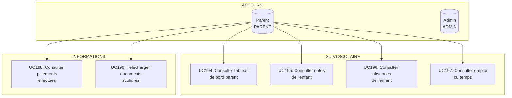

### Détail des cas d'utilisation - Espace Parents

| UC | Cas d'utilisation | Acteur(s) | Description |
|----|-------------------|-----------|-------------|
| UC194 | Consulter tableau de bord parent | PARENT | Vue d'ensemble des enfants et de leurs résultats |
| UC195 | Consulter notes | PARENT | Notes et résultats scolaires de l'enfant |
| UC196 | Consulter absences | PARENT | Historique des absences de l'enfant |
| UC197 | Consulter emploi du temps | PARENT | Emploi du temps de l'enfant |
| UC198 | Consulter paiements | PARENT | Historique des paiements de frais scolaires |
| UC199 | Télécharger documents | PARENT | Bulletins, attestations et autres documents |

---

## 14. - P13 - Processus Qualité

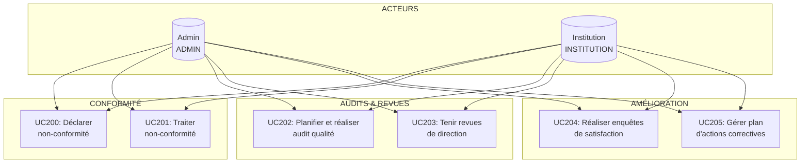

### Détail des cas d'utilisation - Qualité

| UC | Cas d'utilisation | Acteur(s) | Description |
|----|-------------------|-----------|-------------|
| UC200 | Déclarer non-conformité | INSTITUTION, ADMIN | Signalement d'une non-conformité qualité |
| UC201 | Traiter non-conformité | ADMIN, INSTITUTION | Analyse et traitement des NC |
| UC202 | Planifier/réaliser audit | ADMIN, INSTITUTION | Planification et exécution des audits qualité |
| UC203 | Revues de direction | ADMIN, INSTITUTION | Comptes-rendus des revues de direction |
| UC204 | Enquêtes satisfaction | ADMIN, INSTITUTION | Création et analyse des enquêtes |
| UC205 | Actions correctives | ADMIN, INSTITUTION | Plan et suivi des actions correctives |

---

## 15. - P14 - Processus Stages & Insertion

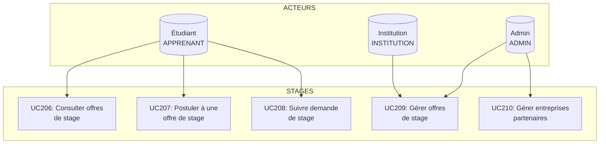

### Détail des cas d'utilisation - Stages

| UC | Cas d'utilisation | Acteur(s) | Description |
|----|-------------------|-----------|-------------|
| UC206 | Consulter offres stage | APPRENANT | Consultation des offres de stage disponibles |
| UC207 | Postuler à offre stage | APPRENANT | Candidature à une offre de stage |
| UC208 | Suivre demande stage | APPRENANT | Suivi de l'état de la demande |
| UC209 | Gérer offres stage | ADMIN, INSTITUTION | CRUD des offres de stage |
| UC210 | Gérer entreprises partenaires | ADMIN, INSTITUTION | CRUD des entreprises partenaires |

---

## 16. - P15 - Processus Reporting Global

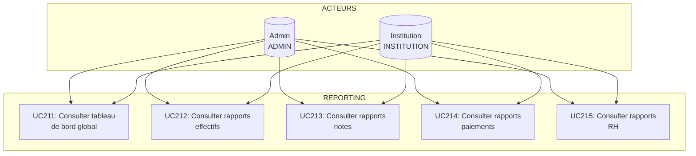

### Détail des cas d'utilisation - Reporting

| UC | Cas d'utilisation | Acteur(s) | Description |
|----|-------------------|-----------|-------------|
| UC211 | Tableau de bord global | ADMIN, INSTITUTION | Vue consolidée de tous les KPIs |
| UC212 | Rapports effectifs | ADMIN, INSTITUTION | Statistiques sur les effectifs |
| UC213 | Rapports notes | ADMIN, INSTITUTION | Statistiques sur les notes et résultats |
| UC214 | Rapports paiements | ADMIN, INSTITUTION | Statistiques financières consolidées |
| UC215 | Rapports RH | ADMIN, INSTITUTION | Statistiques RH (effectifs, paie, congés) |

---

## ANNEXE A - Matrice Acteurs × Processus

| Acteur | P1 Pédago. | P2 Compta | P3 RH | P4 E-Learn. | P5 Comm. | P6 GED | P7 Achats | P8 Stocks | P9 Immo | P10 Admin | P11 DocGen | P12 Parents | P13 Qualité | P14 Stages | P15 Reports |
|--------|:----------:|:---------:|:-----:|:-----------:|:--------:|:------:|:---------:|:---------:|:-------:|:---------:|:----------:|:-----------:|:-----------:|:----------:|:-----------:|
| APPRENANT | X | X | - | X | X | X | - | - | - | X | X | - | - | X | - |
| ENSEIGNANT | X | - | X | X | X | - | - | - | - | X | - | - | - | - | - |
| ADMIN | X | X | X | X | X | X | X | X | X | X | X | - | X | X | X |
| INSTITUTION | X | X | X | - | X | X | X | - | X | X | X | - | X | X | X |
| CAISSIER_BANQUE | X | X | - | - | - | - | - | - | - | X | - | - | - | - | - |
| CABINET_COMPTABLE | X | X | - | - | - | - | - | - | - | - | - | - | - | - | - |
| ESA_COMPTA | X | X | X | - | - | X | X | X | X | - | - | - | - | - | - |
| COMITE_ORIENTATION | X | - | - | - | - | - | - | - | - | - | - | - | - | - | - |
| RESSOURCES_HUMAINES | - | - | X | - | - | - | - | - | - | - | - | - | - | - | - |
| SECRETAIRE | X | - | - | - | - | X | - | - | - | - | X | - | - | - | - |
| PARENT | X | X | - | - | X | - | - | - | - | - | - | X | - | - | - |
| SURVEILLANT | X | - | - | - | - | - | - | - | - | - | - | - | - | - | - |

---

## ANNEXE B - Statistiques de couverture

| Processus | Nombre de cas d'utilisation | Étendue |
|-----------|:---------------------------:|---------|
| P1 - Pédagogique | 31 | UC01 → UC31 |
| P2 - Financier & Comptable | 30 | UC32 → UC61 |
| P3 - RH, Paie & HAO | 28 | UC62 → UC89 |
| P4 - E-Learning | 19 | UC90 → UC108 |
| P5 - Communication | 8 | UC109 → UC116 |
| P6 - GED | 13 | UC117 → UC129 |
| P7 - Achats & Marchés | 13 | UC130 → UC142 |
| P8 - Stocks | 10 | UC143 → UC152 |
| P9 - Immobilisations | 11 | UC153 → UC163 |
| P10 - Administration | 16 | UC164 → UC179 |
| P11 - DocGen | 14 | UC180 → UC193 |
| P12 - Espace Parents | 6 | UC194 → UC199 |
| P13 - Qualité | 6 | UC200 → UC205 |
| P14 - Stages | 5 | UC206 → UC210 |
| P15 - Reporting | 5 | UC211 → UC215 |
| **TOTAL** | **215** | |

---

## ANNEXE C - Matrice de traçabilité Lot → UC

| Lot du PLAN-PROJET | Processus | Cas d'utilisation couverts |
|---------------------|-----------|---------------------------|
| Lot 0 - Stabilisation | P1, P2, P10 | UC01-UC10, UC32-UC46, UC164-UC179 |
| Lot 1 - Quick Wins | P1 | UC05, UC18, UC22 |
| Lot 2 - Salles paramétrables | P1 | UC13 |
| Lot 3 - Scan QR / pointage | P1, P3 | UC16, UC68 |
| Lot 4 - Alertes échéances | P2 | UC33, UC36 |
| Lot 5 - Registres académiques | P1 | UC22, UC24 |
| Lot 6 - Clôture semestre | P1 | UC28-UC31 |
| Lot 7 - Arborescence | P1 | UC06, UC16 |
| Lot S0-S4 - États SYSCOHADA | P2 | UC47-UC52 |
| Lot F1 - Clôture exercice | P2 | UC56-UC58 |
| Lot F2 - Flux trésorerie/SIG | P2 | UC53-UC55 |
| Lot F3 - Connexions + TVA | P2, P7 | UC59-UC61, UC130-UC142 |
| Lot R1 - Référentiel RH | P3 | UC62-UC67 |
| Lot R2 - Heures pointages | P3 | UC68-UC74 |
| Lot R3 - Paie prestataires | P3 | UC77-UC83 |
| Lot R4 - Suivi HAO annuel | P3 | UC75-UC76 |
| Lot R5 - Complétude paie Togo | P3 | UC77-UC79 |
| Lot EL1 - Rattachement | P4 | UC90, UC104 |
| Lot EL2 - Catalogue arborescent | P4 | UC90-UC92 |
| Lot EL3 - Arborescence entités | P4 | UC93-UC108 |

---

> **Note :** Les cas d'utilisation sont identifiés par un numéro séquentiel unique (UC01 → UC215) pour faciliter la traçabilité entre les diagrammes, le code source et les exigences métier. Chaque UC peut être affiné en scénarios (flux nominal, alternatif, d'erreur) lors de la phase de conception détaillée.
